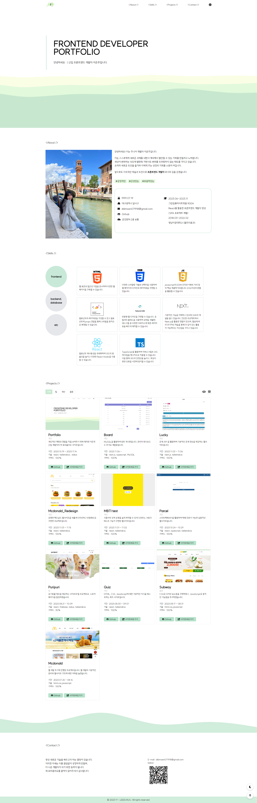

# 포트폴리오
개인적인 역량과 경험을 직접 보여주기 위해 제작한 이은주 신입 개발자의 첫 포트폴리오 사이트입니다

🔗 LINK : https://portfolio-hazel-beta-32.vercel.app/

💻 PERIOD : 2023.10.19 ~ 2023.11.14

🔨 STACK

  

🌙 다크 모드와 🌍 다국어 지원

- Redux Toolkit의 createSlice와 configureStore를 활용하였습니다.

- 다크 모드의 경우, theme라는 이름의 slice를 생성하였고, 초기 상태는 로컬 스토리지에서 'theme' 항목을 가져오거나, 해당 항목이 없을 경우 'light'로 설정하였습니다. toggleTheme라는 reducer를 통해, 현재 상태가 'light'이면 'dark'로, 그렇지 않으면 'light'로 테마를 토글하는 기능을 구현하였습니다.

- 다국어 지원의 경우, language라는 이름의 slice를 생성하였고, 초기 상태는 로컬 스토리지에서 'language' 항목을 가져오거나, 해당 항목이 없을 경우 'kr'로 설정하였습니다. setLanguage라는 reducer를 통해, 액션의 payload를 받아 현재 상태를 갱신하는 기능을 구현하였습니다.

- 마지막으로, configureStore를 통해 두 slice를 포함하는 스토어를 생성하였습니다. 이렇게 해서 사용자의 편의성을 높이는 다크 모드와 다국어 지원 기능을 성공적으로 구현하였습니다.

